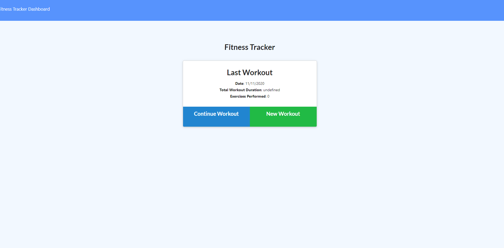
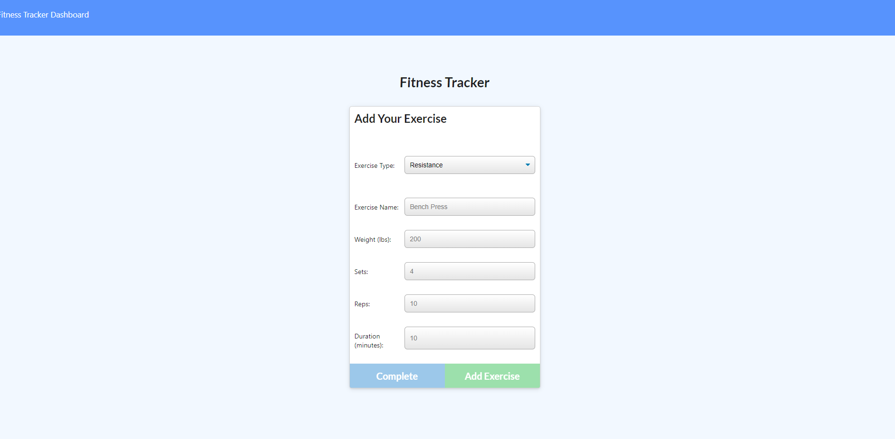
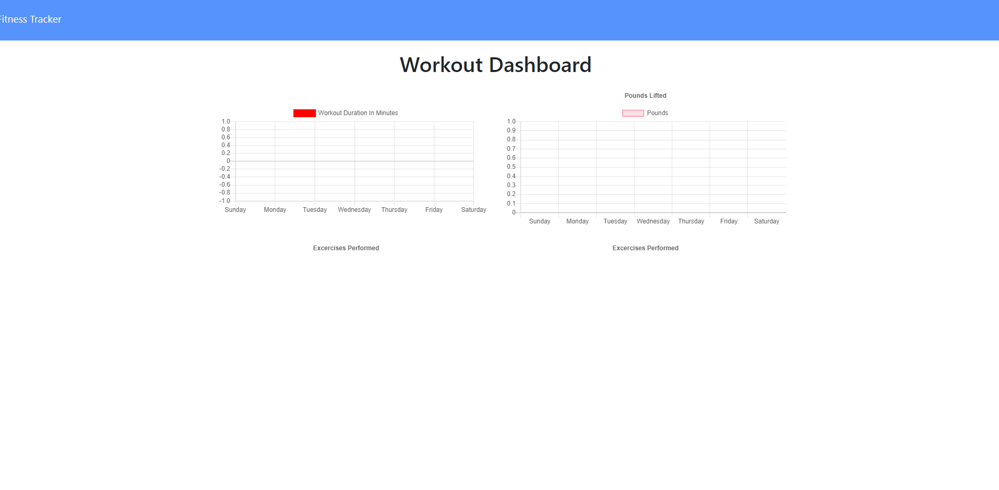

# Workout_Tracker

## Description
A simple to use, well put together, workout tracker that will help you reach your fitness goals quickly while you track your workout progress. 
## User Story
As a user, I want to be able to view create and track daily workouts. I want to be able to log multiple exercises in a workout on a given day. I should also be able to track the name, type, weight, sets, reps, and duration of exercise. If the exercise is a cardio exercise, I should be able to track my distance traveled.

## How to Use
  <a href="https://thawing-crag-27488.herokuapp.com/?id=5fac9423ad27a70017f1a099" target="blank">Click here to get started</a> 
   
   
   

## Contributing
Contributions are what make the open source community such an amazing place to be learn, inspire, and create. Any contributions you make are greatly appreciated.

To contribute: 
<ul>
<li>Fork the Project</li>
<li>Create your Feature Branch (git checkout -b feature/AmazingFeature)</li>
<li>Commit your Changes (git commit -m 'Add some AmazingFeature')</li>
<li>Push to the Branch (git push origin feature/AmazingFeature)</li>
<li>Open a Pull Request</li>
</ul>

## License
